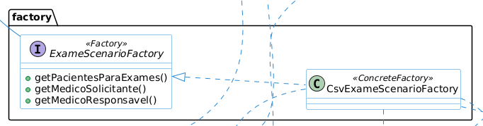
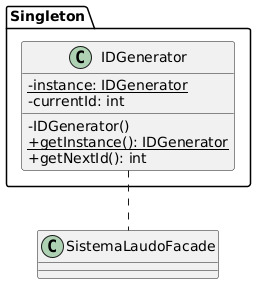
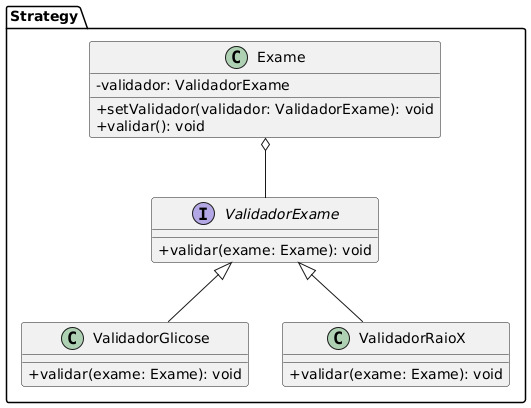
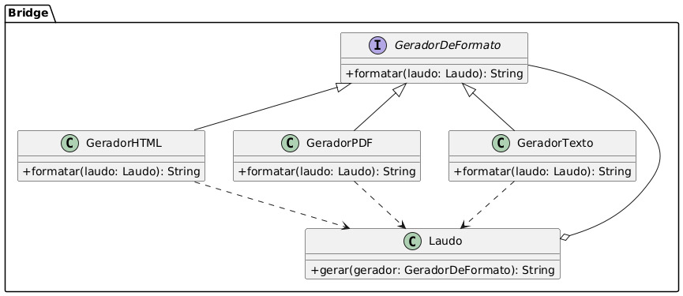
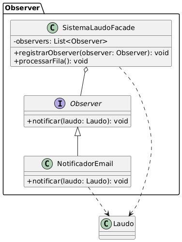
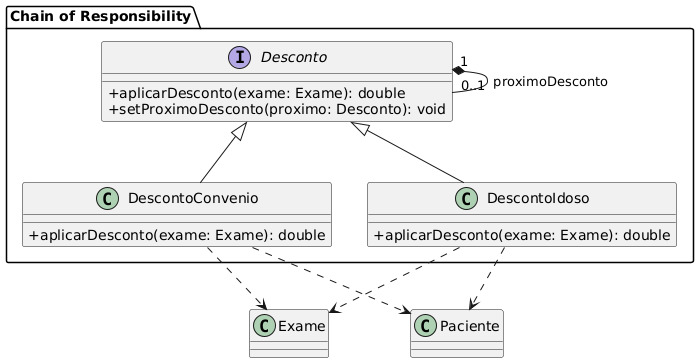
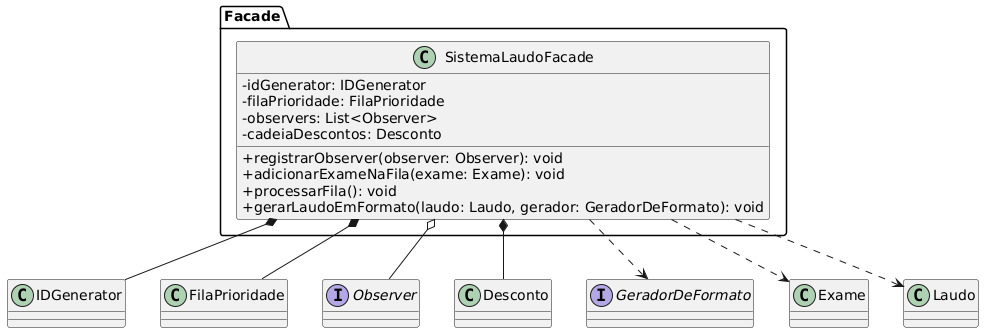

Sistema de Laudos e Diagnósticos
Este projeto é um sistema de gerenciamento de laudos médicos desenvolvido em Java, utilizando uma arquitetura orientada a objetos e diversos padrões de projeto para garantir escalabilidade, organização e robustez.

O sistema é capaz de processar exames de diferentes tipos, aplicar regras de negócio, validar informações e gerar laudos de forma dinâmica.

Funcionalidades Principais
Processamento por Prioridade: Os exames são processados com base na sua prioridade (URGENTE, POUCO_URGENTE, ROTINA).

## Aplicação de Descontos Automática: Descontos de convênio e para idosos são aplicados sequencialmente.

Validação Dinâmica: Cada tipo de exame possui uma lógica de validação específica.

Geração de Laudos Flexível: Os laudos podem ser gerados em diferentes formatos (Texto, HTML, PDF) com facilidade.

Geração de ID Único: Cada exame recebe um ID sequencial e único.

Arquitetura e Padrões de Projeto
A arquitetura do sistema foi desenhada com base em padrões de projeto para desacoplar as responsabilidades e tornar o código mais limpo e manutenível.

## Padrões utilizados

### Factory (R1)

A implementação é feita com a interface ExameScenarioFactory (a fábrica abstrata) e a classe CsvExameScenarioFactory (a fábrica concreta), que lê os dados de um arquivo CSV.
Como funciona : Em vez de ter dados de pacientes e médicos codificados diretamente no programa, a classe CsvExameScenarioFactory lê um arquivo CSV. Ela processa cada linha do arquivo e usa as informações para instanciar objetos como Paciente e Medico.

### Singleton (R2)

Onde é usado: Classe IDGenerator.

Como funciona: A classe IDGenerator garante que apenas uma única instância de si mesma possa ser criada, fornecendo um ponto de acesso global (IDGenerator.getInstance()). Isso assegura que todos os IDs de exames gerados sejam sequenciais e únicos, evitando duplicações.

### Strategy + Bridge (R3)

Emitir laudo dos seguintes exames: Sanguíneo, Raio-X e Ressonância Magnética. Outros tipos de exames poderão surgir no futuro, como por exemplo a Tomografia. Os novos tipos de exames a serem adicionados não devem impactar o funcionamento do código já existente.
Onde é usado: Classes ValidadorGlicose, ValidadorRaioX, etc. (padrão Strategy) e classes LaudoSanguineo, GeradorHTML, GeradorPDF, etc. (padrão Bridge).

#### Bridge (R4)

Onde é usado: Classe Laudo e a interface GeradorDeFormato com suas implementações (GeradorHTML, GeradorPDF, GeradorTexto).

Como funciona: A classe Laudo (a Abstração) é desacoplada da sua forma de geração (a Implementação). O método laudo.gerar() recebe um objeto GeradorDeFormato, o que permite que um laudo seja gerado em qualquer formato (PDF, HTML, etc.) sem que a classe Laudo precise saber os detalhes de cada geração.

#### Strategy (R5)

Onde é usado: Interface Validador e suas implementações (ValidadorGlicose, ValidadorRaioX, ValidadorRessonancia).

Como funciona: Cada Exame (o Contexto) contém uma referência para um Validador. O método exame.validar() delega a lógica de validação para o Validador associado, permitindo que a validação seja alterada em tempo de execução sem modificar a classe Exame.

### Observer (R6)

Onde é usado: Interface Observer, classe NotificadorEmail e a lista de observadores na classe SistemaLaudoFacade. Aplicado como simulação de envio de notificacão através de chamadas SysOut.

Como funciona: O SistemaLaudoFacade (o Sujeito) mantém uma lista de Observers (NotificadorEmail). Quando um laudo é gerado, o Facade notifica todos os observadores, que então executam suas tarefas (como enviar um e-mail), sem que o Facade precise saber os detalhes de como a notificação é feita.

### Chain of Responsibility (R7)

Onde é usado: Classes Desconto (DescontoConvenio, DescontoIdoso).

Como funciona: A aplicação de descontos é organizada em uma cadeia. Uma requisição de desconto é iniciada e passa por cada manipulador (DescontoConvenio, DescontoIdoso) em sequência. Cada manipulador decide se aplica o desconto ou passa a requisição para o próximo na cadeia.

### Fila de Prioridade (R8)

Onde é usado: Classe FilaPrioridade.

Como funciona: Utiliza a classe nativa do Java, PriorityQueue, com um Comparator personalizado para ordenar os exames. Isso garante que os exames com maior prioridade (URGENTE) sejam processados antes dos de menor prioridade (ROTINA).

### Facade (R9)

Onde é usado: Classe SistemaLaudoFacade.

Como funciona: Atua como um "painel de controle central". A classe Main interage apenas com o Facade, que esconde a complexidade de múltiplos subsistemas (fila, cadeia de descontos, validadores, etc.) e orquestra o fluxo de processamento de exames.
